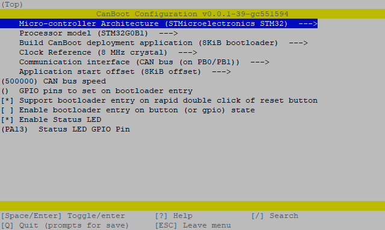

# CanBoot bootloader (optional)

[Canboot](https://github.com/Arksine/CanBoot) is a bootloader for MCUs to be able to update/flash them via CANBUS.  
With CanBoot there is no physical intervention (e.g. pressing the boot button) required to flash/update firmware to the
MCUs.

## Download CanBoot
Clone the CanBoot repository:
``` bash
cd ~
git clone https://github.com/Arksine/CanBoot
```
To add CanBoot to your moonraker update manager, add this section to your config (optional):
``` yaml title="moonraker.conf"
[update_manager canboot]
type: git_repo
origin: https://github.com/Arksine/CanBoot.git
path: ~/CanBoot
is_system_service: False
```

## Configure CanBoot for the EBB
Open the config dialog with the following commands:
``` bash
cd ~/CanBoot
make menuconfig
```
and use following config settings:
- Micro-controller Architecture: **STMicroelectronics STM32**
- Processor model: **STM32G0B1**
- Build CanBoot deployment application: **8KiB bootloader**
- Clock Reference: **8 MHz crystal**
- Communication interface: **CAN bus (on PB0/PB1)**
- Application start offset: **8KiB offset**
- CAN bus speed: **500000**
- Support bootloader entry on rapid double click of reset button: **check** *(optional but recommend)*
- Enable Status LED: **check**
- Status LED GPIO Pin: **PA13**

this should then look like this:
<figure markdown>
  
  <figcaption>CanBoot config for EBB devices</figcaption>
</figure>
use `q` for exit and `y` for save these settings.

These lines just clear the cache and compile the CanBoot bootloader:
``` bash
make clean
make
```

## Flash CanBoot to the EBB
!!! danger "Before you start the flashing process, disconnect the heater from the board!"

    Up to version v1.1, the heater output is switched to on in DFU mode while in this mode!  
    This can lead to a fire! 🔥  
    Like in the next picture where the door bell ringed 🔔  
    In version v1.2, this pin has changed because of this issue.

    <figure markdown>
        
        <figcaption>(only the printer was harmed - picture used with permission)</figcaption>
    </figure>

First, you have to put the board into DFU mode. To do this, press and hold the boot button and then disconnect and
reconnect the power supply, or press the reset button on the board. With the command `dfu-util -l`, you can check if the
board is in DFU mode.

If dfu-util can discover a board in DFU mode it should then look like this:

If this is not the case, repeat the boot/restart process and test it again.

If your board is in DFU mode, you can flash CanBoot with the following command:
``` bash
dfu-util -a 0 -D ~/CanBoot/out/canboot.bin -s 0x08000000:mass-erase:force:leave
```

Now press the reset button and if the flash process was successfully one LED should blink now.

## Update CanBoot
If you want to update CanBoot, you have multiple possible ways to do this.

### Update CanBoot via USB
If you want to update CanBoot via USB, you have to plug in a USB cable and continue with the "old" guide here:
[Flash CanBoot to the EBB](#flash-canboot-to-the-ebb)

### Update CanBoot via CAN
Since the board can only be addressed via CAN, further CanBoot updates must also be flashed to the board via CAN.
This is very easy with the CanBoot bootloader:
``` bash
python3 ~/CanBoot/scripts/flash_can.py -f ~/CanBoot/out/canboot.bin -i can0 -u <uuid>
```
