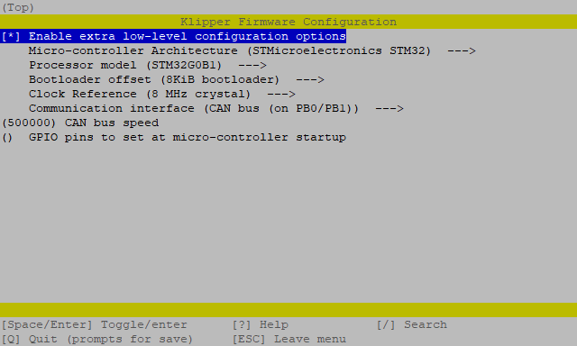

# Klipper Firmware for BigTreeTech EBB
The BigTreeTech EBB series is a toolhead board series that can communicate via CAN. This guide explains which settings
you need, to flash your EBB boards with Klipper.

!!! success "This guide is tested with the following boards:"

    - BTT EBB36 & 42 v1.1
    - BTT EBB36 & 42 v1.2
    - BTT EBB SB2209/2240 v1.0

!!! warning "This guide will not work with the following boards:"

    - BTT EBB36 & 42 v1.0

    These boards have a different MCU.

!!! info

    Use at least a Klipper version of v0.10.0-531 to use the board safely!  
    In [this commit](https://github.com/Klipper3d/klipper/commit/3796a319599e84b58886ec6f733277bfe4f1a747), Kevin fixed a bug in the ADC calculation of the STM32G0.

## Configure Klipper firmware
Open the config interface of the Klipper firmware with following commands:
``` bash
cd ~/klipper
make menuconfig
```
and set the following settings:

- Enable extra low-level configuration options: **check**
- Micro-controller Architecture: **STMicroelectronics STM32**
- Processor model: **STM32G0B1**
- Bootloader offset: **No bootloader** *(without CanBoot)*
- Bootloader offset: **8KiB bootloader** *(with CanBoot)*
- Clock Reference: **8 MHz crystal**
- Communication interface: **CAN bus (on PB0/PB1)**
- CAN bus speed: **500000**

The result should look like this:
<figure markdown>
  
  <figcaption>Klipper config for EBB devices</figcaption>
</figure>
use `q` for exit and `y` for save these settings.

Now clear the cache and compile the Klipper firmware:
``` bash
make clean
make
```

## Flash Klipper
There are two ways to flash the Klipper firmware to the EBB.

- [Flash the firmware via USB](#flash-klipper-via-usb) 
- [Flash the firmware via CAN](#flash-klipper-via-can) (recommended) (only with CanBoot)

### Flash Klipper via USB
This is the classic way to flash the firmware to the EBB.

??? danger "Before you start the flashing process, disconnect the heater from the board!"

    Up to version v1.1, the heater output is switched to on in DFU mode while in this mode!  
    This can lead to a fire! 🔥  
    Like in the next picture where the door bell ringed 🔔  
    In version v1.2, this pin has changed because of this issue.

    <figure markdown>
        
        <figcaption>(only the printer was harmed - picture used with permission)</figcaption>
    </figure>

First, you have to put the board into DFU mode. To do this, press and hold the boot button and then disconnect and
reconnect the power supply, or press the reset button on the board. With the command `dfu-util -l`, you can check if the
board is in DFU mode.

It should then look like this:


If your board is in DFU mode, you can flash Klipper with the following command:
``` bash
dfu-util -a 0 -D ~/klipper/out/klipper.bin -s 0x08000000:mass-erase:force:leave
```


### Flash Klipper via CAN
This is the recommended way to flash the firmware, when you use CanBoot on your board.

Find the UUID of your board:
``` bash
python3 ~/CanBoot/scripts/flash_can.py -i can0 -q
```
The output should look like this:


With the UUID you have just read, you can now flash the board with:
``` bash
python3 ~/CanBoot/scripts/flash_can.py -f ~/klipper/out/klipper.bin -i can0 -u <uuid>
```


## Add the MCU in Klipper
Finally, you can add the board to your Klipper `printer.cfg` with its UUID:
``` yaml title="printer.cfg"
[mcu EBB]
canbus_uuid: <uuid>

# embedded temperature sensor
[temperature_sensor EBB]
sensor_type: temperature_mcu
sensor_mcu: EBB
min_temp: 0
max_temp: 100
```

If you don't know the UUID of your EBB, you can read it out with the following command:
``` bash
~/klippy-env/bin/python ~/klipper/scripts/canbus_query.py can0
```
The output should look like this:
