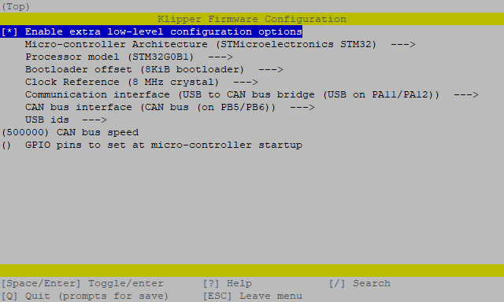

# Klipper USB-to-CAN bus bridge

Klipper has also the posibillity to use the U2C as a USB-to-CAN bus bridge. This is a good solution if you want to use
the board as a CANBUS adapter for your printer and an MCU at the same time.  
In the case of the BigTreeTech U2C, this solution has no advantages over the candlelight firmware, since no freely
usable pins are available on the board.

!!! success "This guide is tested with the following boards:"

    - BigTreeTech U2C v1.1

    This guide was verified on a Pi running [MainsailOS](https://github.com/mainsail-crew/MainsailOS){:target="_blank"}

## Configure Klipper firmware
Open the config interface of the Klipper firmware with following commands:
``` bash
cd ~/klipper
make menuconfig
```
and set the following settings:

- Enable extra low-level configuration options: **check**
- Micro-controller Architecture: **STMicroelectronics STM32**
- Processor model: **STM32F072**
- Bootloader offset: **No bootloader** *(without CanBoot)*
- Bootloader offset: **8KiB bootloader** *(with CanBoot)*
- Clock Reference: **8 MHz crystal**
- Communication interface: **USB to CAN bus bridge (USB on PA11/PA12)**
- CAN bus interface: **CAN bus (on PB8/PB9)**
- CAN bus speed: **500000**

The result should look like this:
<figure markdown>
  
  <figcaption>Klipper config for U2C v1.x in bridge mode</figcaption>
</figure>
use `q` for exit and `y` for save these settings.

Now clear the cache and compile the Klipper firmware:
``` bash
make clean
make
```

## Flash Klipper
There are two ways to flash the Klipper firmware to the EBB.

- [Flash the firmware via USB](#flash-klipper-via-usb) (without CanBoot)
- [Flash the firmware via CAN](#flash-klipper-via-can) (with CanBoot)

### Flash Klipper via USB
This is the classic way to flash the firmware to the board.

First, you have to put the board into DFU mode. To do this, press and hold the boot button and then disconnect and
reconnect the power supply, or press the reset button on the board. With the command `dfu-util -l`, you can check if the
board is in DFU mode.

It should then look like this:


If your board is in DFU mode, you can flash Klipper with the following command:
``` bash
dfu-util -a 0 -D ~/klipper/out/klipper.bin -s 0x08000000:mass-erase:force:leave
```


### Flash Klipper via CAN
This is the recommended way to flash the firmware to the EBB.

!!! node "The U2C must be in the bootloader mode"

    The status LED should blink in the bootloader mode. If not, double press the reset button to enter the bootloader
    mode.

Find the UUID of your U2C:
``` bash
python3 ~/CanBoot/scripts/flash_can.py -i can0 -q
```
The output should look like this:


With the UUID you have just read, you can now flash the board with:
``` bash
python3 ~/CanBoot/scripts/flash_can.py -f ~/klipper/out/klipper.bin -i can0 -u <uuid>
```


## Add can0 interface

Now you only have to create the interface in the OS. to do this, create the file `/etc/network/interfaces.d/can0` and
fill it with the following content.

```bash
# open file with nano
sudo nano /etc/network/interfaces.d/can0
```

``` title="/etc/network/interfaces.d/can0"
allow-hotplug can0
iface can0 can static
    bitrate 500000
    up ifconfig $IFACE txqueuelen 128
```

To save and close the nano editor:  
`ctrl+s` => save file  
`ctrl+x` => close editor

After a reboot, the can interface should be ready.

## Add the MCU in Klipper (optional)
Finally, you can add the EBB to your Klipper `printer.cfg` with its UUID:
``` yaml title="printer.cfg"
[mcu U2C]
canbus_uuid: <uuid>

# embedded temperature sensor
[temperature_sensor U2C]
sensor_type: temperature_mcu
sensor_mcu: U2C
min_temp: 0
max_temp: 100
```

If you don't know the UUID of your U2C, you can read it out with the following command:
``` bash
~/klippy-env/bin/python ~/klipper/scripts/canbus_query.py can0
```
The output should look like this:

