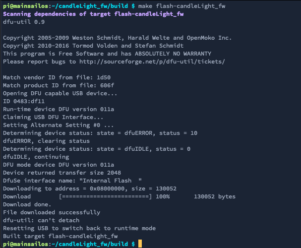

# CandleLight_FW (U2C v1.x)

CandleLight_FW is a firmware for STM32F042x/STM32F072xB based USB-CAN adapters.

Github: [github.com/candle-usb/candleLight_fw](https://github.com/candle-usb/candleLight_fw)

## Compile CandleLight_FW
```bash
# install requirements
sudo apt-get install cmake gcc-arm-none-eabi

cd ~
# clone git repo
git clone https://github.com/candle-usb/candleLight_fw
cd candleLight_fw

# create cmake toolchain
mkdir build
cd build
cmake .. -DCMAKE_TOOLCHAIN_FILE=../cmake/gcc-arm-none-eabi-8-2019-q3-update.cmake

# compile firmware
make candleLight_fw
```

## Flash CandleLight_FW
First, the adapter must boot in DFU mode. Press the boot button and then connect the USB cable. With `dfu-util -l`,
you can check whether the adapter is booted in DFU mode. This should look like this:

<figure markdown>
  { width="800" }
  <figcaption>dfu-util -l output</figcaption>
</figure>

If the BTT U2C has booted in DFU mode, you can flash it with this command:

```bash
make flash-candleLight_fw
```

<figure markdown>
  { width="500" }
  <figcaption>make flash-candleLight_fw output</figcaption>
</figure>

## Add can0 interface

Now you only have to create the interface in the OS. to do this, create the file `/etc/network/interfaces.d/can0` and
fill it with the following content.

```bash
sudo nano /etc/network/interfaces.d/can0
```

``` title="/etc/network/interfaces.d/can0"
auto can0
iface can0 can static
    bitrate 250000
    up ifconfig $IFACE txqueuelen 128
```

To save and close the nano editor:  
`ctrl+o` => save dialog  
`ENTER` => confirm filename  
`ctrl+x` => close editor

After a reboot, the can interface should be ready.