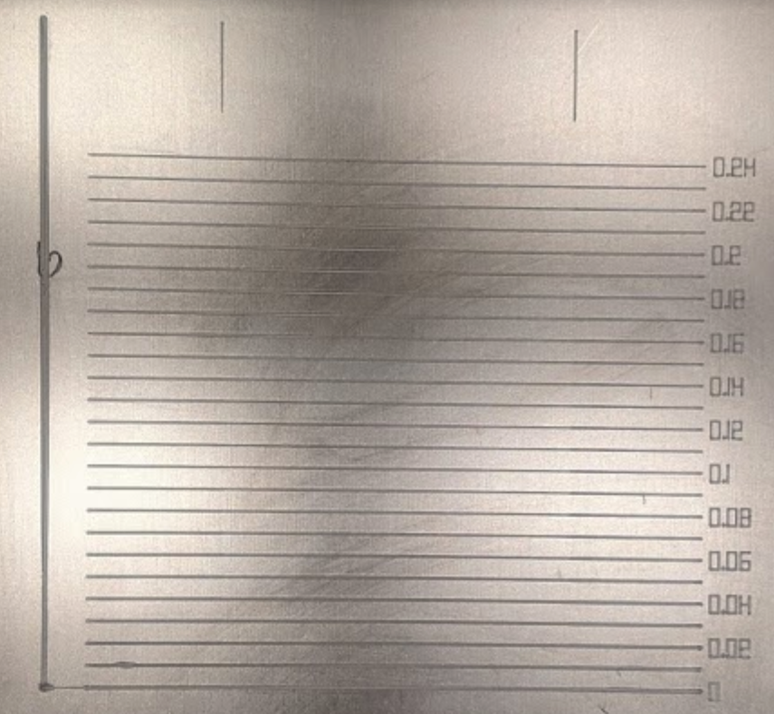
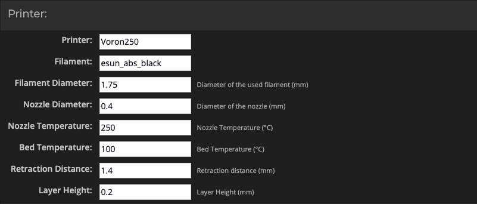
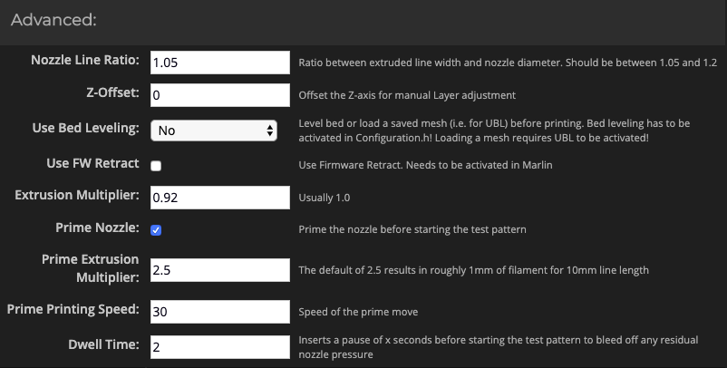

# PA-Calibration with LA-Test

This is a fast calibration test for Pressure Advanced. The idea was from
[FHeilmann](https://github.com/FHeilmann){:target=_blank}.



## Requirements
At first, we have to add a gcode-macro to convert the M900 LA gcode to set the Pressure Advance value. Please add the
following lines in your `printer.cfg`.
``` yaml title="printer.cfg"
[gcode_macro M900]
description: Set Pressure Advance
gcode: SET_PRESSURE_ADVANCE ADVANCE={params.K|default(0)}
```

## Generate G-code
Now we use the [Marlin k-factor tool](https://marlinfw.org/tools/lin_advance/k-factor.html){:target=_blank} to generate
the G-code. Here are my parameters I used to generate the pattern in the picture above.

<figure markdown>
  
  <figcaption>Change Hotend, Bed-Temperature and Retraction-Distance</figcaption>
</figure>

<figure markdown>
  
  <figcaption>Resize the bed to your size</figcaption>
</figure>

<figure markdown>
  
  <figcaption>Change the Retract Speed to your Retract-Speed</figcaption>
</figure>

<figure markdown>
  
  <figcaption>
    Ending Value max is 1 (Bowden). If you use a Direct-Drive printer, you can set the "Ending Value for K" to 0.25 and
    "K-faktor Stepping" to 0.01. If you like to print the Numbers per Line, check-in the "Line Numbering" (the numbers
    are horrible to remove from your buildplate).
  </figcaption>
</figure>

<figure markdown>
  
  <figcaption>Change the "Extrusion Multiplier" for you filament</figcaption>
</figure>

Fill in a Filename in the field and click on "Generate G-code". Modify the Start-Gcode on the right side and click on
"Download as file".

## Print the G-code
Now print the pattern and look at which line is most constant. Count the lines from below and multiply with the
"K-factor Stepping" value. This is your perfect Pressure Advance value.

Happy printing!